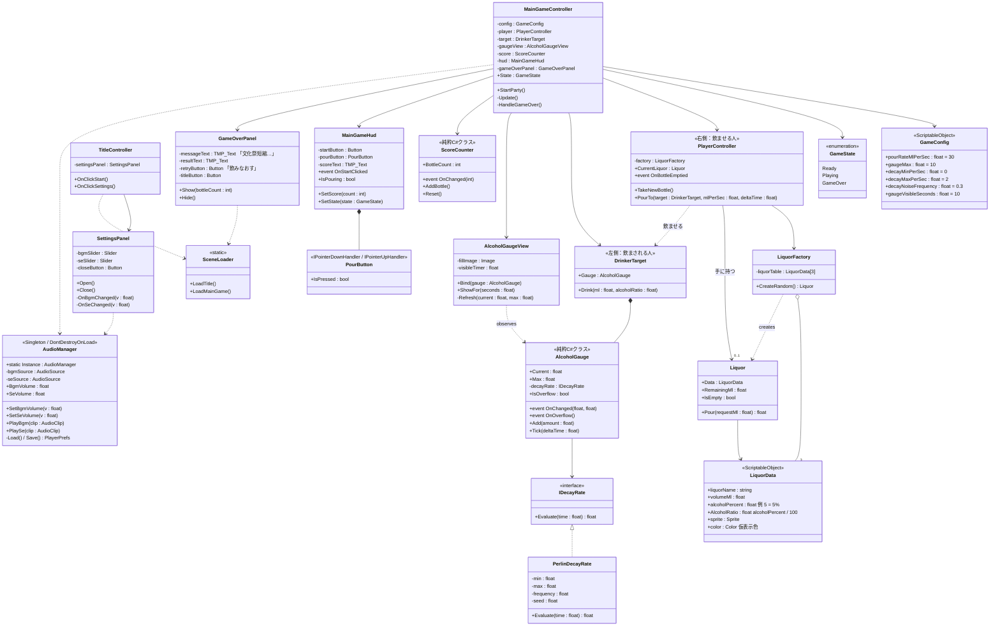

# クラス図（初版）

## シーン構成

| シーン | 内容 |
|---|---|
| `Title` | スタート / 設定パネル |
| `MainGame` | 飲み会本編。ゲームオーバーは同シーン内のパネルで表示（「飲みなおす」＝シーン再読込） |

`AudioManager` のみ `DontDestroyOnLoad` でシーンをまたいで常駐します。

## クラス図



## 主要ロジック（毎フレーム）

```
MainGameController.Update (State == Playing)
 ├─ if hud.IsPouring:
 │    player.PourTo(target, dt)
 │      ml = CurrentLiquor.Pour(config.pourRateMlPerSec * dt)   // 30ml/秒 固定
 │      target.Drink(ml, data.AlcoholRatio) → Gauge.Add(ml * ratio)
 │      if CurrentLiquor.IsEmpty → OnBottleEmptied → score.AddBottle() → TakeNewBottle()（ランダム）
 ├─ target.Gauge.Tick(dt)        // 減少量 = decayRate.Evaluate(経過時間) * dt（0未満にはしない）
 └─ Gauge.OnOverflow → HandleGameOver() → GameOverPanel.Show(score)
```

- ゲージ表示: `StartParty()` で `gaugeView.ShowFor(10)`、10秒後に非表示（値は内部で更新し続ける）。
- クリア条件なし。ゲームオーバーからのみ終了。

## ゲージ減少量（ランダム・連続）

毎秒の減少量を 0〜2 の範囲で**なめらかに**変化させるため、Perlinノイズを使います。

```csharp
public float Evaluate(float time)
{
    float n = Mathf.Clamp01(Mathf.PerlinNoise(time * frequency, seed)); // 0〜1 の連続値
    return Mathf.Lerp(min, max, n);                                     // 0〜2 /秒
}
```

- `seed` はゲーム開始時に `Random.Range(0f, 1000f)` で決めるので、毎回違う変化になります。
- `frequency` が小さいほどゆっくり変化します（0.3 なら数秒かけてうねる程度）。
- `Mathf.PerlinNoise` は範囲外の値をわずかに返すことがあるため `Clamp01` しています。

## 確定事項

1. アルコール度は **%** で持つ（`alcoholPercent = 5` → 加算時 `ml × 5 / 100`）。
2. 「飲ませる」は **長押し** で注ぎ続ける（`PourButton`）。
3. 減少量は **0〜2/秒のランダム値を連続的に変化**（Perlinノイズ）。
4. スコアは **1本飲み切った時点で +1**。
5. ゲージの長さは **キャラ画像の高さの80%** まで。
6. ゲージ上限は **10**（元仕様の50から変更）。
